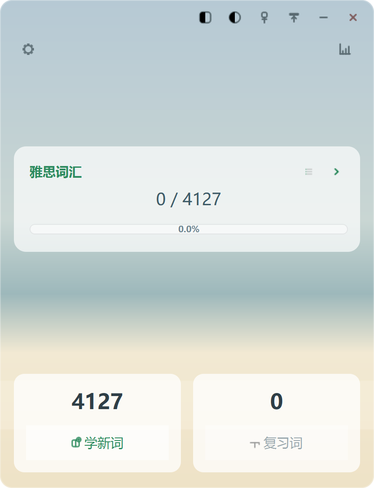
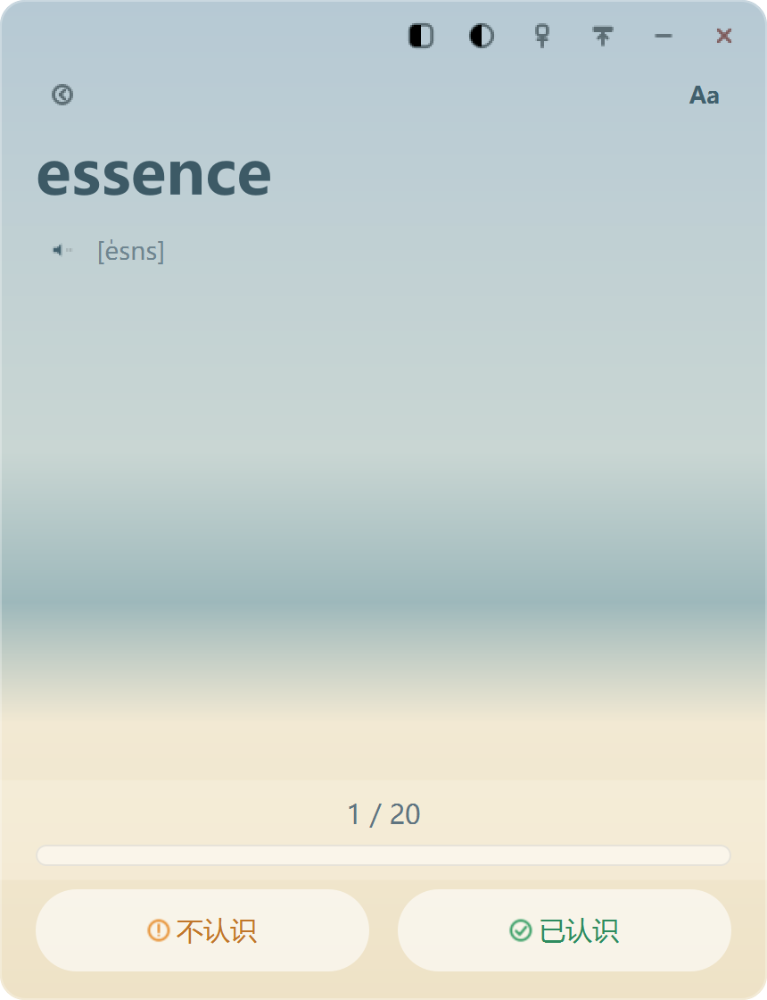
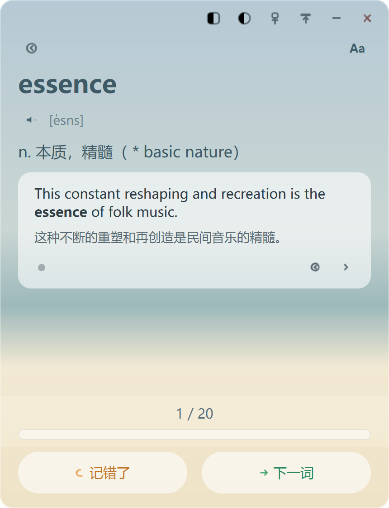
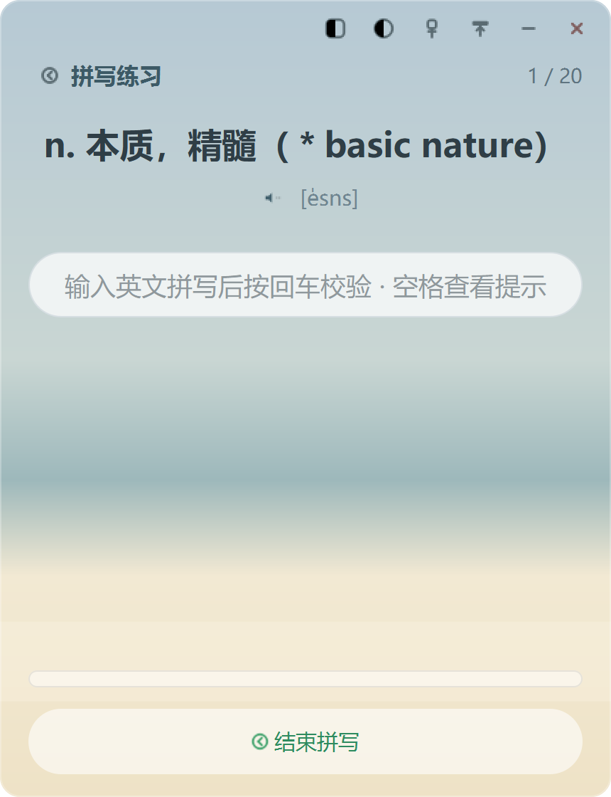
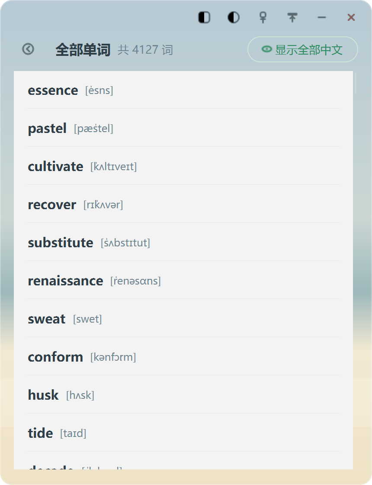
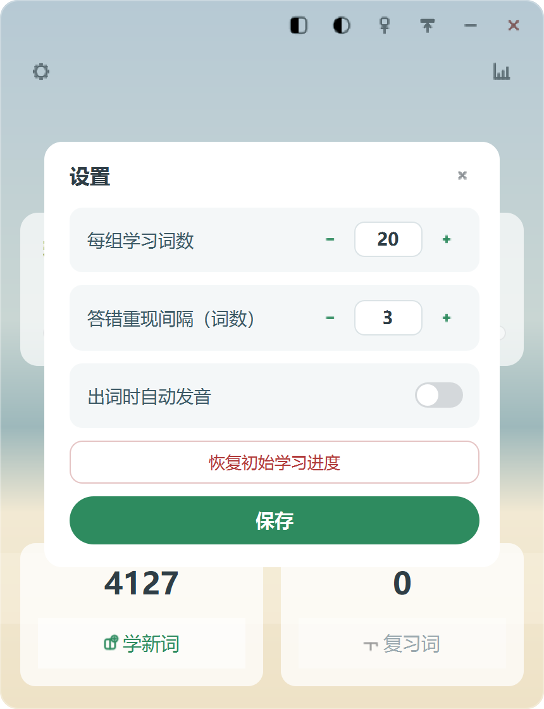
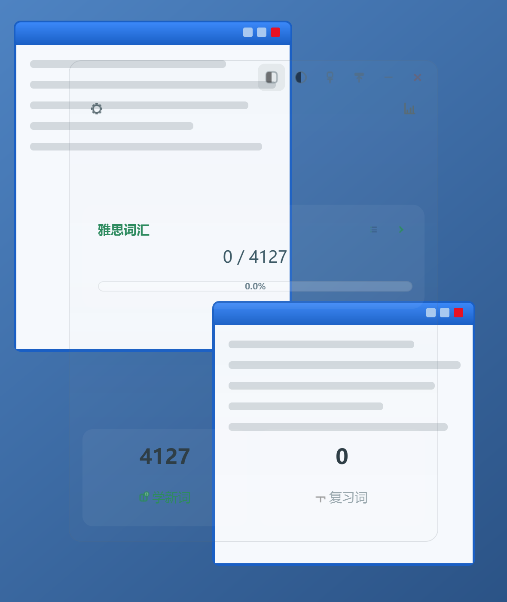
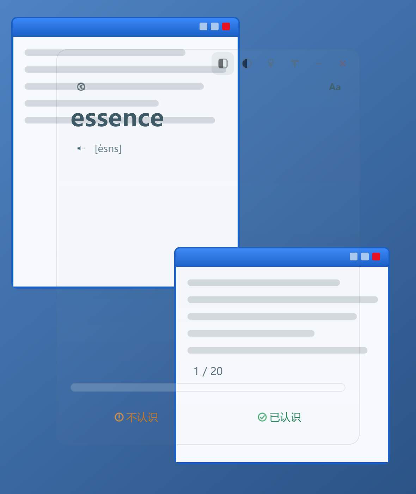
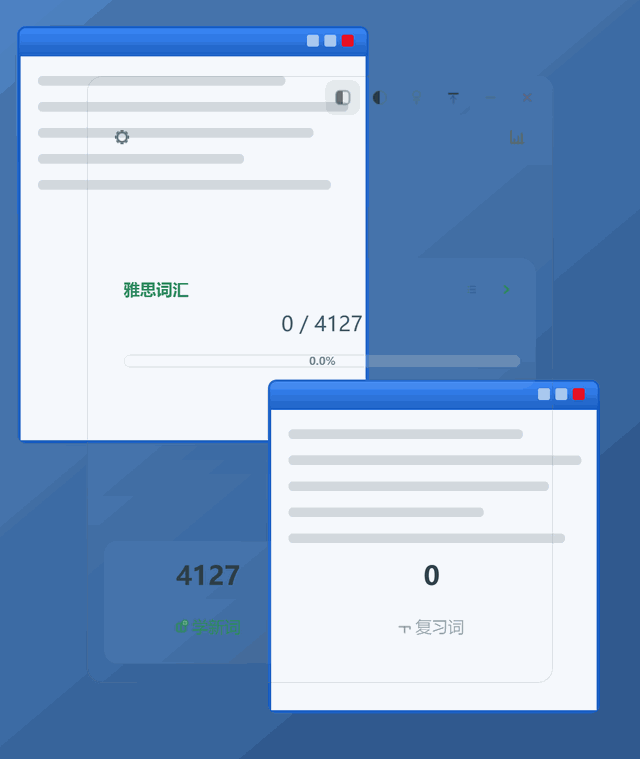

<div align="center">

# WordMem 背单词

**一款极简风格的 Windows 桌面背单词软件 —— 本地离线、开源免费、数据随身**

[](https://github.com/ZengChin/WordMem/releases)
[](https://opensource.org/licenses/MIT)
[](https://www.python.org/)
[](https://doc.qt.io/qtforpython/)
[](https://github.com/ZengChin/WordMem/releases)

背单词 · 间隔重复 · SM-2 记忆算法 · 艾宾浩斯遗忘曲线 · 雅思词汇 · 考研词汇 ·
离线发音 · 便携绿色软件 · PySide6 · SQLite

[功能特性](#功能特性) · [下载安装](#下载安装) · [快速上手](#快速上手) · [自定义词库](#自定义词库) · [开发构建](#开发构建)

</div>

---

## 简介

WordMem 是一款基于 **PySide6 + SQLite** 的桌面背单词应用，界面与交互参考主流背单词 App：
海滩色卡片式首页、沉浸式背单词页、透明模式与不透明度调节条。所有数据保存在本地，
无需注册、无需联网，词库与记忆进度随主程序目录整体迁移。

- **为谁准备**：备考雅思 / 考研等英语考试，希望有一款轻量、离线、无广告的桌面背单词工具的用户。
- **核心理念**：极简界面 + 科学复习（SM-2 间隔重复），打开即背，背完即走。

## 界面预览

<table>
  <tr>
    <td align="center"><br><b>首页</b><br>词书进度与学习入口</td>
    <td align="center"><br><b>背单词·出题</b><br>单词 + 音标 + 发音</td>
    <td align="center"><br><b>背单词·作答</b><br>释义 + 例句轮播</td>
  </tr>
  <tr>
    <td align="center"><br><b>拼写练习</b><br>看释义拼单词</td>
    <td align="center"><br><b>单词列表</b><br>全词浏览，点行显隐</td>
    <td align="center"><br><b>设置</b><br>每组词数 / 重现间隔 / 发音</td>
  </tr>
  <tr>
    <td align="center"><br><b>隐形模式·首页</b><br>整窗透明，桌面透出</td>
    <td align="center"><br><b>隐形模式·背单词</b><br>边工作边瞄单词</td>
    <td align="center"><br><b>自动隐藏</b><br>鼠标移出仅留菜单栏</td>
  </tr>
</table>

> 截图由 `scripts/capture_screenshots.py` 自动生成，界面更新后可一键重新生成。

## 功能特性

### 学习体验

- **卡片式首页**：词书进度卡片（已学 / 总数、百分比进度条），学新词 / 复习词入口与剩余词数一目了然。
- **沉浸式背单词页**
  - 出题态：大字号单词 + 音标 + 发音按钮，底部「不认识 / 已认识」。
  - 作答态：点击后展开释义与例句卡片（例句轮播：圆点指示 + 左右切换），
    按钮切换为「记错了 / 下一词」或「记住了 / 下一词」。
  - 完成态：本组小结（记住 / 需巩固），一键返回首页。
  - `Aa` 按钮循环切换单词字号，配置自动持久化。
- **拼写练习**：看中文释义与听发音，输入英文拼写，回车校验、空格提示，对错即时反馈。
- **单词列表**：当前词书全量单词虚拟化列表，默认隐藏中文，点行显隐，支持一键切换。

### 记忆算法

- **SM-2 间隔重复**：难度因子 ease + 动态间隔 1/3/6/… 天，间隔 ≥21 天视为已掌握；
  已掌握词到期后仍会周期性唤醒复习，忘记则降级重建。
- **错词重现**：答错的词每隔若干词（默认 2，可在设置调整）在组内重现，直到答对为止。

### 窗口与外观

无边框圆角窗口，右上角依次为：

1. **透明模式**：整窗降为低不透明度但保留高亮轮廓，可再次点击还原；
2. **不透明度滑条**：弹出线性滑杆，实时调节按钮与字体不透明度，再次点击或点击外部即隐藏；
3. 窗口置顶、自动折叠（鼠标移出仅保留菜单栏）、最小化、关闭。

### 数据与离线

- **离线发音**：Windows SAPI 朗读（pyttsx3），无需联网；未安装时自动隐藏该能力。
- **便携数据**：数据库、配置、日志全部存放在主程序同目录的 `WordMem/` 文件夹，
  整个目录拷走即完成迁移，U 盘可用。
- **内置词库**：雅思核心词汇 4127 词（含音标 / 释义 / 例句），另附考研高频精选词库；
  支持从 Anki 词库包转换自定义词库（见下文）。

## 下载安装

前往 [**Releases**](https://github.com/ZengChin/WordMem/releases) 页面下载最新版本：

| 文件 | 说明 |
| --- | --- |
| `WordMem-x.y.z-setup.exe` | 安装包（推荐），向导式安装，自动创建快捷方式 |
| `WordMem/` 免安装目录 | 解压即用，双击 `WordMem.exe` 运行 |

> 数据存放在程序同目录的 `WordMem/` 文件夹中，卸载或迁移时直接复制该文件夹即可。

## 快速上手

从源码运行（需要 Python 3.10+）：

```bash
git clone https://github.com/ZengChin/WordMem.git
cd WordMem
python -m venv .venv
.venv\Scripts\pip install -r requirements.txt
.venv\Scripts\python run.py
```

首次启动会自动将内置词库导入 SQLite；之后每天打开软件，按首页提示
「学新词」或「复习词」即可，算法会自动安排复习节奏。

## 自定义词库

词库为 JSON 格式（音标 / 释义 / 例句）。`scripts/apkg_to_words.py` 可将
Anki 词库包（`.apkg`）转换为该格式（用法见脚本内 docstring）。

更换默认词库后再次启动，软件会检测到词库变化并清空旧库重新导入。

## 数据与配置

| 内容 | 位置 |
| --- | --- |
| 词库种子 | `src/wordmem/resources/data/`（`ielts_words.json` / `kaoyan_words.json`） |
| 用户数据 | 主程序同目录 `WordMem/`（`wordmem.db` / `config.json` / `logs/`） |

## 开发构建

运行单元测试：

```bash
.venv\Scripts\pip install pytest
.venv\Scripts\pytest
```

一键构建 Windows 发行包（PyInstaller 打包 + Inno Setup 生成安装程序）：

```bash
.venv\Scripts\python scripts\build_windows.py
```

产物输出至 `dist/`：`WordMem/WordMem.exe`（免安装目录版）与
`WordMem-<版本>-setup.exe`（安装包）。

## 项目结构

```
WordMem/
├── run.py                     # 开发启动入口
├── pyproject.toml             # 打包与工具配置
├── requirements.txt
├── src/wordmem/
│   ├── app.py                 # 组装与入口（日志 / 异常兜底 / 依赖装配）
│   ├── config/                # 路径解析与用户配置（JSON 持久化）
│   ├── core/
│   │   ├── models.py          # 领域模型与记忆调度纯函数
│   │   ├── repository.py      # SQLite 数据访问
│   │   ├── study_service.py   # 学习会话编排（业务服务层）
│   │   └── tts.py             # 发音服务（后台队列）
│   ├── ui/
│   │   ├── main_window.py     # 无边框主窗口（透明模式 / 置顶 / 自动隐藏）
│   │   ├── title_bar.py       # 自定义标题栏
│   │   ├── opacity_popup.py   # 线性不透明度调节条（横向滑杆弹窗）
│   │   ├── widgets.py         # 通用控件（胶囊按钮 / 卡片 / 进度条…）
│   │   ├── icons.py           # QPainter 程序化图标
│   │   ├── theme.py           # 调色板与全局样式
│   │   └── views/             # 首页 / 学习页 / 拼写页 / 单词列表 / 对话框
│   └── resources/data/        # 词库种子 JSON
├── scripts/                   # 构建 / 词库转换 / 界面截图脚本
├── packaging/                 # Inno Setup 安装包配置
├── docs/images/               # README 界面截图（脚本自动生成）
└── tests/                     # pytest 单元测试
```

## 技术栈

- **界面**：PySide6（Qt for Python），无边框自绘窗口，QPainter 程序化图标
- **存储**：SQLite（标准库 sqlite3）
- **发音**：pyttsx3（Windows SAPI 离线语音）
- **打包**：PyInstaller + Inno Setup
- **测试**：pytest

## License

本项目基于 [MIT License](https://opensource.org/licenses/MIT) 开源。

---

<div align="center">

如果这个项目对你有帮助，欢迎点一个 **Star** 支持一下。

也欢迎提交 [Issue](https://github.com/ZengChin/WordMem/issues) 反馈问题与建议。

</div>
